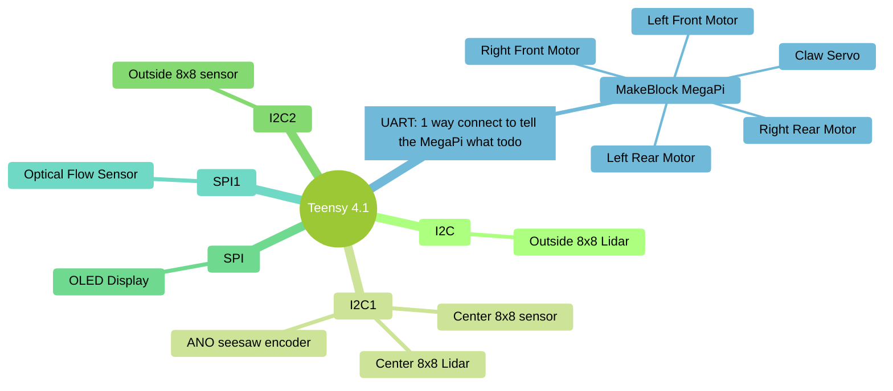

```mermaid

%%{init: {'theme':'forest'}}%%
mindmap
  root((Teensy 4.1))
    I2C
      Outside 8x8 Lidar
    I2C1
      Center 8x8 Lidar
      ANO seesaw encoder
      Center 8x8 sensor
    I2C2
      Outside 8x8 sensor
    SPI
      OLED Display
    SPI1
      Optical Flow Sensor
    UART["`UART: 1 way connect to tell the MegaPi what todo`"]
      MakeBlock MegaPi
        Left Front Motor
        Left Rear Motor
        Right Front Motor
        Right Rear Motor
        Claw Servo
```
