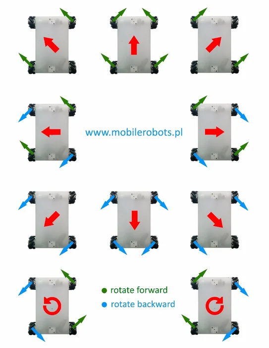
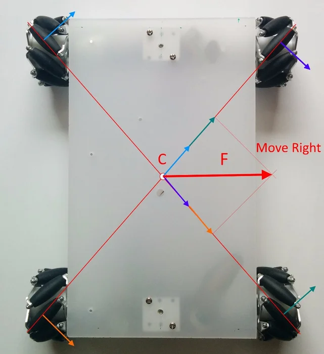

# Making sure all the credit is given to the right places/people

From: https://www.instructables.com/Mecanum-wheel-robot-bluetooth-controlled/

- 
- 

A vector mechanics textbook
- [Vector Mechanics for Engineers](https://www.amazon.com/Vector-Mechanics-Engineers-Ferdinand-Beer/dp/0070043892/ref=sr_1_1?crid=8D57ELZF64NY&keywords=isbn+0-07-004389-2&qid=1685130083&s=books&sprefix=isbn+0-07-004389-2%2Cstripbooks%2C119&sr=1-1) *still have this book from jr. college*

Coding ideas
- [Curio Res Tutorials](https://github.com/curiores/ArduinoTutorials)